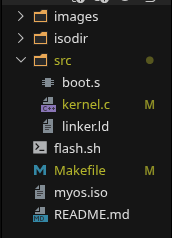

# DISCLAIMER
NEVER AND I MEAN DO NOT RUN THE flash.sh FILE if you have multiple drives
because that shell script is hardcoded for sdb(in my case the second drive was my usb flash drive thats why it was sdb) we use that shell script to flash the iso image for pen drive and check carefully what label your pendrive is in it will be in form of sdX where X could be either b c or idk whatever but be carefull because it can wipe out your existing OS if not carefull with the name

# BareBones from OSdev forum
link -> https://wiki.osdev.org/Bare_Bones
A minimal, freestanding 32-bit x86 kernel built from scratch.

## Project Overview
its a monolithic kernel designed to run on bare-metal hardware. It implements the Multiboot standard, allowing it to be loaded by the GRUB bootloader. The kernel bypasses host-system libraries (like `libc`) to interface directly with the VGA text buffer for hardware-level output. (i still dont get it)


## Prerequisites
To build this kernel, you must use an `i686-elf` cross-compiler toolchain. This prevents the compiler from linking against host-specific libraries (like `glibc`), which do not exist in a bare-metal environment.


## Installation Arch Linux / EndeavourOS / Manjaro
```bash
# Install essential build tools
sudo pacman -S --needed base-devel

# Install pre-built cross-compiler toolchain
yay -S i686-elf-binutils-bin i686-elf-gcc-bin

#Install the emulator
sudo pacman -S qemu-desktop

```
## Installation Debian / Ubuntu / Linux Mint / Pop!_OS
```bash

# 1. Update your local registry mirrors
sudo apt update

# 2. Install essential build structures and x86 hardware emulators
sudo apt install -y build-essential git make qemu-system-x86

# 3. Install the bare-metal freestanding cross-compiler toolchain
sudo apt install -y gcc-i686-linux-gnu binutils-i686-linux-gnu

```

## Installtion Fedora / RHEL
```bash
# 1. Install foundational compilation suites and QEMU x86 emulation systems
sudo dnf groupinstall -y "Development Tools"

sudo dnf install -y git qemu-system-x86

# 2. Install the target cross-compiler tools
sudo dnf install -y cross-binutils-common i686-elf-binutils i686-elf-gcc
```


## Steps for you my friend

* i hope that cross compiler shit is installed successfully now we need to do is to make a dir `*osdev*` or `*barebones*` whatever

* make a src dir and then add three files `*boot.s*`, `*kernel.c*` and `*linker.ld*`

* why the frick i m even typing i have uploaded the whole shit lol(i forgor)


## Project Structure



the fact that there are two object files and a alien binary file they will appear once you follow the build n run section successfully

## Build n Run Cmd

LOCK IN HERE (all the cmds to compile the files are in the makefile)

| Command | Action |
| :--- | :--- |
| `make` | Compiles source files and links them into `myos.bin` |
| `make run` | Builds the project and launches QEMU with debug logs |
| `make clean` | Removes object files and binary outputs |
| `make clean && make run` | just use this |


## Debugging

* The **`make run`** target is configured with specific QEMU flags to assist in kernel debugging:

* **`-d int,cpu_reset`**: Enables logging for hardware interrupts and CPU reset events.
* **`-no-reboot`**: Halts the emulator on a Triple Fault, allowing you to examine the register dump provided by QEMU.

## lol
[Dunning-Kruger](https://en.wikipedia.org/wiki/Dunning–Kruger_effect)


foreshadowing


someday we will reach this stage
